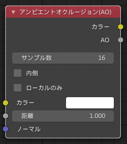
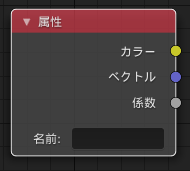
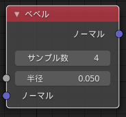
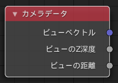
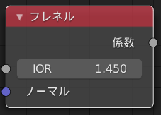
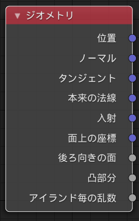
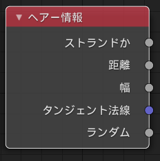
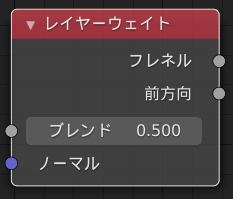
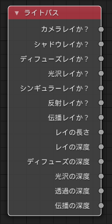
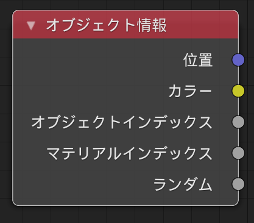

# Shader Node
## 入力
### アンビエントオクルージョン(AO)

アンビエントオクルージョン（以下AO）シェーダーは、頂点上のどのくらいの範囲が遮られてるのかということを計算します。これはプローシジャル（手続き型）テクスチャにも使え、たとえば角のみ風化させることができます。

Cycleでは、これは重いシェーダーで、レンダリングを明らかに遅くします。もし、レンダリング時間が気になるなら、ジオメトリノードの"凸部分"を使うか、AOをベイクすることで早くなるでしょう。

#### 入力
##### カラー
AOを出力するときの色合い
##### 距離 `Cycles Only`
頂点が遮られていると考えられる他のオブジェクトの距離
##### ノーマル
ノーマルはAOのために使用されます。もし何も接続しなかった場合はデフォルトのノーマルが使われます。

#### プロパティ
##### サンプル数 `Cycles Only`
レイトレースのAO抽出に用いるサンプリング数
##### 内側 `Cycles Only`
メッシュ内のオクルージョンを計算し、凹面ではなく凸面の形状を検出します
##### ローカル `Cycles Only`
対象物自体のみのオクルージョンを検出し、それ以外のものは検出しません

#### 出力
##### カラー
色調のあるAO
##### AO
色調のないAOの係数

### 例

### 属性ノード

属性ノードによってオブジェクトやメッシュに付与された属性値を取得する事ができます。

#### 入力
このノードに入力はありません。

#### プロパティ
##### 名前
その属性の名前です。ほとんどの属性は以下を除いて、各種入力ノードを通してより簡単に取得できます。※と、原文にはありますが、以下のほとんどの属性も新しくノードが追加されました。

##### 頂点カラーレイヤー(Vertex Color Layer) ※2.81から頂点カラーノードが追加
その名前で取得することができます

##### 密度(Desity)※2.8からボリューム情報ノードが追加
流体領域内のスモークの密度を定義するスカラーを与えます。

##### 色(color)※2.8からボリューム情報ノードが追加
流体領域内のスモークの色を与えます。その色とベクトルの出力は同じです。その係数出力はチャンネルの平均値を出力します。

##### 温度(Temperature)※2.8からボリューム情報ノードが追加
ボリュームの温度を定義するスカラーを与えます。0～1の範囲の値は0～1000ケルビンの値に対応しています。lackbodyシェーダやPrincipled Volumeシェーダを使って物理ベースの火をレンダリングするために使用することができます。

##### 炎(Flame)※2.8からボリューム情報ノードが追加
流体領域内の炎の密度を定義したスカラーを与えます。3つの出力すべてが同じ値を返します。

##### オーシャンモディファイアの泡(Ocean Foam)
オーシャンモディファイア適用中に泡ができる場所を定義したスカラーを与えます。これはこのプロパティに入力された名前に依存します。

#### 出力
##### 色
指定した属性から補間される RGB 色情報が返されます。
##### ベクトル
指定した属性から補間される XYZ の 3 次元ベクトルが返されます。
##### 係数
指定した属性から補間されるスカラーが返されます。

### ベベルノード `Cycles Only`

ベベルシェーダーノードは角を丸めたレンダリングをするのに使用されます。バンプマップのように、これは実際のジオメトリには影響せず、シェーディングにのみ影響を与えます。少しエッジを丸めることは、現実に見えるような鏡面反射を表現するのを助けます。

これはとても重いシェーダーであり、他にも複雑な要素が多いときでもレンダリングが20%遅くなる可能性があることに注意してください。そのため多くの場合、ベイクをするか、レンダリング時間が問題にならない静止画像のレンダリングに使用することをお勧めします。ベベルモディファイアは、実行するときベベルシェーダーより高速な機能ですが、複雑な形状のときや、乱雑な形状の時に失敗することがあります。

#### 半径
辺におけるベベルの幅

#### ノーマル
（出力する）ノーマルにベベルするためのノーマルで、例えばバンプノードと組み合わせて使用します。

### プロパティ
#### サンプル数
サンプル数はそれぞれのシェーダーを評価するために使用されます。大きいサンプル数はより正確な結果をもたらしますが、レンダリングが遅くなります。4というデフォルト値は多くのケースで巧く働き、より多くのAA（アンチエイリアス）サンプルを使用することで、ノイズを晴らします。

### 出力
#### ノーマル
基礎的なノーマルを出力します。
### 例

### カメラデータノード

カメラデータノードはカメラに対するオブジェクトの位置に関するの情報を取得するために使用されます。これは例えばカメラから離れるた時にオブジェクトのシェーディングを変更したり、カスタムフォグエフェクトを作成したりするために使用することができます。

#### 入力
このノードに入力はありません

#### プロパティ
このノードにはプロパティはありません。

#### 出力
##### ビューのベクトル
カメラからシェーディングポイントまでのカメラ空間ベクトル

##### ビューのZ深度
各ピクセルとカメラとの距離。

##### ビューの距離
カメラとシェーディング点との距離。

### フレネルノード

Fresnel (フレネル)あるいは Dielectric Fresnel (誘電フレネル) ノードはある層の境界でどれだけの光が反射され、残りが層の中に屈折するかを計算します。その結果である重み値は Mix Shader ノードを用いて多層シェーダーに用いられます。その計算結果はサーフェス法線と視界との角度の違いに依存します。

最も一般的な使用方法としては、二つのBSDFsをミックスするときにミックスシェーダーノードのブレンド要素として使用されます。シンプルなガラスマテリアルの場合は、光沢のある屈折と光沢のある反射の間でミックスします。グレージング角（90°-入射角のこと、ここではカメラからの光の入射角が45°以上の角度、もしくは臨界角）において、多くのライトは現実のように屈折よりもおおく反射されます。

光を拡散させる基礎部分と光沢を持った表面による二層構造のマテリアルにおいても、同様の設定、Diffuse と Glossy の BSDF ノードを混合を用いることができます。Fresnel ノードを混ぜあわせる要素として用いる事で、どの光が光沢を持ったコート層を通過と屈折した後拡散させる基礎部分に入射するか、および反射されるかを定義できます。
#### 入力
##### IOR (屈折率)
設定されたマテリアルの屈折率 (IOR)。
##### Normal (法線)
出力に影響するバンプマップもしくは法線マップを接続するための入力。
#### プロパティ
このノードにプロパティは有りません。
#### 出力
##### Factor (因数)
Frensnel weight (フレネル重み値)、どれだけの光線がある層を通過せずに反射するかを示す。

### ジオメトリノード

ジオメトリノードは現在のシェーディングポイントに関する幾何学的情報を返します。全てのベクトル座標系は World 空間 内に存在します。ボリュームシェーダーでは、そのPosition (位置)と Incoming (入射)のベクトル値だけ利用できます。
#### 入力
このノードに入力はありません。
#### プロパティ
このノードにプロパティは有りません。
#### 出力
##### Position (位置)
シェーディングポイントの位置。
##### Normal (法線)
サーフェスにおいてシェーディングで用いる法線 (Smooth の法線とバンプマッピングを含む)。
##### Tangent (接線)
サーフェスに対する接線。
##### True Normal (真法線)
サーフェスの幾何もしくは平面状の法線。
##### Incoming (入射)
視認される方向からシェーディングポイントに向いたベクトル。
##### Parametric (パラメトリック)
サーフェス上のシェーディング頂点のパラメトリックな座標。
平面マッピングのUV座標を
To area lights it outputs its UV coordinates in planar mapping and in spherical coordinates to point lights.※わかりませんでした
##### Backfacing (背面表示)
その面が背面から視認されていれば 1.0 に、前面から表示されていれば 0.0 になります。
##### Pointiness `Cycles Only`
頂点ごとのメッシュの湾曲の近似値。明るい値は凸角をしめし、暗い値は凹角を示します。それは汚れマップや、摩耗エフェクトを作るのを可能にします。
##### Random Per Island `Cycles Only`
メッシュの各接続コンポーネント（島）に対するランダムな値。木の葉っぱ、木目、もしくは複数のスプラインからなるカーブのような分離したユニットで構成されたメッシュにバリエーションを与えるのに便利です。

### Hair Info (ヘアー関連情報)ノード

Hair Info ノードは Hair に関連した情報を参照します。
#### 入力
このノードに入力はありません。
#### プロパティ
このノードにプロパティは有りません。
#### 出力
##### Is Strand (ストランドへの影響)
シェーダーがストランドに影響を与えている場合は 1 を、それ以外の場合は 0 を返します。
##### Intercept (遮断)

光線がストランド上のどの点に衝突したかを示します(先端が 1 で根本が 0 となります)。
##### Thickness (厚さ)

光線が衝突したストランド上の点においてのストランドの厚さ。
##### Tangent Normal (タンジェント法線)
ストランドの法線に対する接線ベクトル。
##### Random
0から1の範囲でヘアーごとのランダムな値。たとえばカラーランプと組み合わせて、ヘアーの色をランダムにする

### Layer Weight (レイヤーウェイト) ノード

レイヤーウェイト ノードは通常 ミックスシェーダーノードと共にシェーダーの重ねあわせに用いられるウェイトを出力します。
#### 入力
##### Blend (混合度)
0 から 1 の間で偏りを示す値を出力します。一様でないシェーダーの混合に有用です。
##### Normal (ノーマル)
バンプマップもしくはノーマルマップを接続する事で出力に影響を与えるための入力です。
#### プロパティ
このノードにプロパティは有りません。
#### 出力
##### Fresnel (フレネル重み値)
誘電フレネルのウェイト、例えば色をかさねたり、プラスチックマテリアルを作るための光沢シェーダーに便利です。このノードの入力が扱いやすい0.0から1.0の範囲であることが多いことを除けば、このノードの入力はフレネルノードに似ています。
This is like the Fresnel node, except that the input of this node is in the often more convenient 0.0 to 1.0 range.
##### Facing (直面度)
第一のシェーダーと第二のシェーダーとを、サーフェスに対する視点が垂直方向から法線方向に変化する程度に対してどれだけ変化させるかを表す重み値。

### ライトパスノード

ライトパスノードはシェーダーにて実行されるレイがどのタイプかを見つけます。特に、NPR表現のワンポイントに便利です。それぞれのタイプについてのより詳しい情報は[ライトパスドキュメント](https://docs.blender.org/manual/ja/latest/render/cycles/render_settings/light_paths.html)にあります。

#### 入力
このノードに入力はありません。
#### プロパティ
このノードにプロパティはありません。
#### 出力
##### カメラレイか？
もし、シェーディングがカメラからのレイによるものなら1.0を、それ以外なら0.0
##### シャドウレイか？
もし、シェーディングが影からのレイによるものなら1.0を、それ以外なら0.0
##### ディフーズレイか？
もし、シェーディングが拡散光からのレイによるものなら1.0を、それ以外なら0.0
##### 光沢レイか？
もし、シェーディングが光沢からのレイによるものなら1.0を、それ以外なら0.0
##### シンギュラーレイか？`Cycles Only`
もし、シェーディングがシンギュラーレイによるものなら1.0を、それ以外なら0.0
##### 反射レイか？`Cycles Only`
もし、シェーディングが反射レイによるものなら1.0を、それ以外なら0.0
##### 伝播レイか？`Cycles Only`
もし、シェーディングが伝播レイによるものなら1.0を、それ以外なら0.0
##### レイの長さ`Cycles Only`
最後のバウンド、もしくはカメラからライトレイによって移動した距離
##### レイの深度
表面との相互作用でレイが反射したもしくは伝播した回数
> 透明なシェーダを通過しても、通常の「バウンド回数」にはカウントされません。
##### ディフューズの深度`Cycles Only`
レイが拡散反射または透過した回数。
##### 光沢の深度`Cycles Only`
レイが鏡面反射または透過した回数。
##### 透過の深度`Cycles Only`
透明なサーフェスを透過した回数を返す。
##### 伝播の深度`Cycles Only`
X（？）がバウンドした後の透過ライトパスを別のシェーダ、例えば拡散ライトパスに置き換える。最大バウンド回数が少ないため、表面が黒くなるのを避けられる。

### オブジェクト情報ノード

オブジェクト情報ノードはそのオブジェクトインスタンスについての情報を渡します。これは複数のインスタンスに適用された一つのマテリアルにおいてのバリエーションを与えるという使い方ができます。これは、オブジェクトインデックスもしくは位置をもとに手動でコントロールするか、それぞれのインスタンスにごとにランダムに行うことができます。

#### 入力
このノードに入力はありません。

#### プロパティ
このノードにプロパティはありません。

####　出力
##### 位置
ワールド空間におけるオブジェクトの位置
##### 色
オブジェクトの色、`Properties Editor > Object > Viewport Display`上の色と同じ
##### オブジェクトインデックス
オブジェクトのパスインデックス（番号）、`Properties Editor ‣ Object ‣ Relations`上のパスインデックスと同じ
##### マテリアルインデックス
マテリアルのインデックス（番号）、`Properties Editor ‣ Material ‣ Settings`上のインデックスと同じ
##### ランダム
一つのオブジェクトインスタンスに固有の乱数